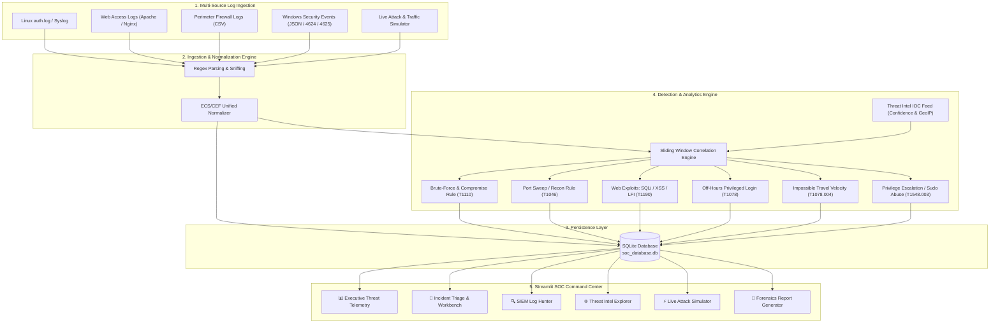

# 🛡️ SOC Sentinel: SIEM Log Monitoring & Threat Detection Platform

[](https://www.python.org/)
[](https://streamlit.io/)
[](https://attack.mitre.org/)
[](https://sqlite.org/)
[](LICENSE)

> **A production-grade, modular Security Information and Event Management (SIEM) and Threat Detection platform built for modern Security Operations Centers (SOC). Ingests heterogeneous security logs, applies sliding-window detection rules mapped to the MITRE ATT&CK framework, correlates threat intelligence IOCs, and provides an interactive Tier-2 analyst triage workbench.**

---

## 📌 Problem Statement & Motivation

Modern enterprise networks generate millions of raw logs daily across firewalls, Linux servers, Windows Domain Controllers, and web servers. Manually inspecting these logs introduces significant detection lag, leaving organizations exposed to credential stuffing, lateral movement, web application exploitation, and privilege escalation.

**SOC Sentinel** solves this challenge by automating the full SIEM lifecycle:
1. **Heterogeneous Log Ingestion & Normalization**: Standardizes unstructured logs into a unified Common Security Event schema.
2. **Sliding-Window Correlation & Threat Detection**: Detects stealthy and multi-stage attacks through temporal thresholds.
3. **MITRE ATT&CK Mapping & Threat Intel Enrichment**: Automatically tags events with official Tactics and Techniques while cross-referencing known adversary IOCs.
4. **Interactive SOC Analyst Command Center**: Provides real-time telemetry, alert triage case management, SIEM log hunting, live adversary simulation, and CISO forensic reporting.

---

## 🏗️ System Architecture



---

## 🎯 Threat Detection Rules & MITRE ATT&CK Matrix

| Detection Rule | MITRE Tactic | Technique ID | Severity | Detection Logic & Threshold |
| :--- | :--- | :--- | :--- | :--- |
| **SSH / Auth Brute Force** | Credential Access (`TA0006`) | `T1110` | **HIGH** / **CRITICAL** | $\ge 5$ failed authentications in $120\text{s}$ sliding window. Escalates to **CRITICAL** if followed by successful authentication (Account Takeover). |
| **Network Port Scan** | Discovery (`TA0007`) | `T1046` | **HIGH** | Single source IP probing $\ge 5$ distinct destination ports within a $60\text{s}$ window. |
| **Web Application Attack** | Initial Access (`TA0001`) | `T1190` | **HIGH** / **CRITICAL** | Regular expression signatures matching SQL Injection (`UNION SELECT`, `' OR '1'='1`), Cross-Site Scripting (`<script>`), and Path Traversal (`../../etc/passwd`). |
| **Off-Hours Privileged Login** | Defense Evasion (`TA0005`) | `T1078` | **MEDIUM** / **HIGH** | Root/Admin authentications occurring between 22:00–06:00 or during weekends from non-corporate IP ranges. |
| **Impossible Travel Anomaly** | Defense Evasion (`TA0005`) | `T1078.004` | **CRITICAL** | Success logins for identical user from distinct geographic IP subnets within $\le 60\text{ minutes}$ (physically impossible velocity). |
| **Privilege Escalation** | Privilege Escalation (`TA0004`) | `T1548.003` | **CRITICAL** | Service accounts (`www-data`, `nobody`) executing root shells (`/bin/bash`, `/bin/sh`) or reading `/etc/shadow`. |

---

## 💻 Tech Stack & Cyber Concepts

| Component | Technology | Role & Purpose |
| :--- | :--- | :--- |
| **Core Programming** | Python 3.10+ | Event normalization, sliding-window algorithms, rule engines |
| **Data Analytics** | Pandas & NumPy | Event grouping, time-series aggregation, structured queries |
| **User Interface** | Streamlit | Cyberpunk dark-themed Tier-2 SOC Analyst Command Center |
| **Visualization** | Plotly | Real-time attack volume timelines, severity donut charts, MITRE matrices |
| **Storage** | SQLite3 | ACID-compliant storage for normalized events, alerts, and triage cases |
| **Parsing** | Python `re` (Regex) | High-performance pattern extraction from unstructured syslog and web logs |
| **Enrichment** | Threat Intel JSON | Simulated IOC correlation, reputation scoring, and GeoIP metadata |
| **Automated Testing** | Pytest | Unit and integration test suite covering parsers, rules, and database operations |

---

## 🚀 Quick Start Guide

### Prerequisites
- Python 3.10 or higher
- Windows / Linux / macOS

### Option 1: 1-Click Launch (Windows)
Double-click `run.bat` or run in PowerShell:
```powershell
.\run.ps1
```
*This automatically provisions the virtual environment, installs dependencies, seeds baseline logs and threat intel, and opens the dashboard in your browser.*

### Option 2: Manual Setup
1. **Clone or Navigate to the Repository**:
   ```bash
   cd soc-threat-detector
   ```
2. **Create and Activate Virtual Environment**:
   ```bash
   # Windows
   py -m venv .venv
   .venv\Scripts\activate

   # Linux/macOS
   python3 -m venv .venv
   source .venv/bin/activate
   ```
3. **Install Dependencies**:
   ```bash
   pip install -r requirements.txt
   ```
4. **Seed Sample Telemetry & Threat Intelligence**:
   ```bash
   python seed_data.py
   ```
5. **Run the SOC Command Center**:
   ```bash
   streamlit run app.py
   ```
   *Dashboard will open at `http://localhost:8501`.*

---

## 🧪 Running Automated Tests

Run the full Pytest test suite:
```bash
pytest -v tests/
```
Output:
```text
tests/test_database.py::test_insert_events PASSED                        [  7%]
tests/test_database.py::test_insert_alert_and_triage PASSED              [ 15%]
tests/test_detection_engine.py::test_brute_force_rule PASSED             [ 23%]
tests/test_detection_engine.py::test_brute_force_compromise_escalation PASSED [ 30%]
tests/test_detection_engine.py::test_port_scan_rule PASSED               [ 38%]
tests/test_detection_engine.py::test_web_attack_rule PASSED              [ 46%]
tests/test_detection_engine.py::test_impossible_travel_rule PASSED       [ 53%]
tests/test_parsers.py::test_auth_parser_ssh_failed PASSED                [ 61%]
tests/test_parsers.py::test_auth_parser_ssh_accepted PASSED              [ 69%]
tests/test_parsers.py::test_auth_parser_sudo PASSED                      [ 76%]
tests/test_parsers.py::test_web_parser_sqli_detection PASSED             [ 84%]
tests/test_parsers.py::test_firewall_parser PASSED                       [ 92%]
tests/test_parsers.py::test_windows_parser PASSED                        [100%]

============================= 13 passed in 0.11s ==============================
```

---

## 📁 Repository Structure

```
soc-threat-detector/
│
├── data/
│   ├── sample_logs/                  # Raw multi-format log files
│   │   ├── auth.log                  # Linux authentication & SSH logs
│   │   ├── web_access.log            # Apache/Nginx web server logs (SQLi, XSS, LFI)
│   │   ├── firewall.csv              # Perimeter firewall connection telemetry
│   │   └── windows_events.json       # Windows Security Events (4624, 4625, 4672)
│   ├── threat_intel/
│   │   └── malicious_ips.json        # Known C2, Tor exit, and scanner IOC feeds
│   └── soc_database.db               # SQLite persistent database
│
├── src/
│   ├── database/
│   │   ├── db_manager.py             # SQLite connection, indexing, and CRUD
│   │   └── models.py                 # Dataclass models (NormalizedEvent, Alert)
│   ├── ingestion/
│   │   ├── auth_parser.py            # Syslog & SSH regex parser
│   │   ├── web_parser.py             # Combined Log Format & URL decode parser
│   │   ├── firewall_parser.py        # Network connection CSV parser
│   │   ├── windows_parser.py         # Windows JSON security log parser
│   │   ├── normalizer.py             # Auto-sniffing unified event normalizer
│   │   └── regex_patterns.py         # Compiled regex expressions
│   ├── detection/
│   │   ├── base_rule.py              # Abstract detection rule base class
│   │   ├── engine.py                 # Detection engine & IOC enrichment coordinator
│   │   ├── mitre_mapping.py          # MITRE ATT&CK taxonomy dictionary
│   │   └── rules/
│   │       ├── brute_force.py        # Sliding-window failed login rule (T1110)
│   │       ├── port_scan.py          # Multi-port sweep detection (T1046)
│   │       ├── web_attacks.py        # SQLi/XSS/LFI signature detection (T1190)
│   │       ├── off_hours_login.py    # Temporal access anomaly detection (T1078)
│   │       ├── impossible_travel.py  # Geographic velocity rule (T1078.004)
│   │       └── priv_escalation.py    # Sudo abuse & shell spawn rule (T1548.003)
│   ├── enrichment/
│   │   └── threat_intel.py           # IP reputation, ASN, and GeoIP lookup
│   ├── simulator/
│   │   └── traffic_generator.py      # Real-time multi-stage attack simulator
│   └── utils/
│       └── report_generator.py       # CISO-ready Markdown forensics reports
│
├── tests/                            # Automated Pytest suite
│   ├── test_parsers.py
│   ├── test_detection_engine.py
│   └── test_database.py
│
├── app.py                            # Streamlit SOC Analyst Command Center
├── seed_data.py                      # Baseline data ingestion script
├── requirements.txt                  # Python dependencies
├── setup.py                          # Package configuration
├── run.bat                           # 1-Click Windows Batch launcher
├── run.ps1                           # 1-Click PowerShell launcher
├── README.md                         # Comprehensive project documentation
└── RESUME_GUIDE.md                   # Placement resume bullets & interview Q&A
```

---

## 📄 License

This project is licensed under the MIT License - feel free to use and adapt for academic and professional placement portfolios.
